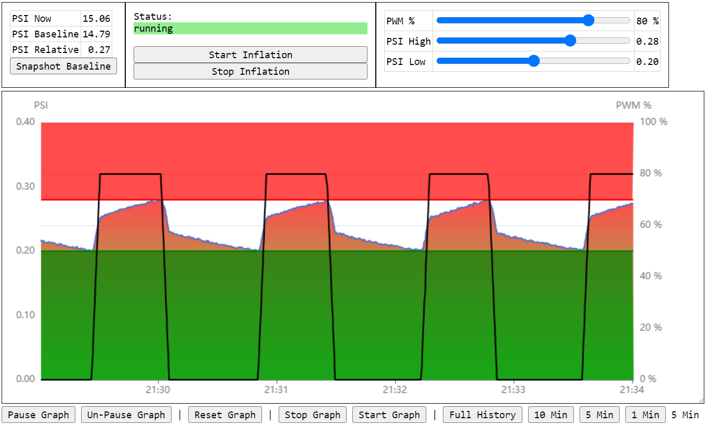

# Balloon Inflator

Tired of the manual effort of inflating pico balloons yourself?  Let a computer do it.

A combination:
- server-side python program running on raspberry pi
- front-end webpage running in your browser

This application allows you to:
- Specify lower and upper thresholds for PSI
- Automatically enable/disable an air pump to stay within those bounds
- Stop the process when a limit switch is triggered
  - This is expected to indicate the balloon is now stretched to the desired size




# Hardware Requirements

Requirements:
- Raspberry Pi (any model running linux)
- Adafruit air pressure sensor module [link](https://www.adafruit.com/product/3965) that I found cheaper (and in stock) on amazon [link](https://www.amazon.com/gp/product/B07JP4Y7S8/ref=ppx_yo_dt_b_asin_title_o01_s00?ie=UTF8&psc=1)
- Air pump which can be controlled via PWM
- Limit switch


# Setup
## Enable RPi I2C

> sudo raspi-config

Select 5 Interfacing Options \
Select I2C \
Select Yes to enable I2C

Make sure your pressure sensor is plugged in and run this command. \
You should see that device 0x18 responds (as shown in the table below).
> sudo i2cdetect -y 1

```
     0  1  2  3  4  5  6  7  8  9  a  b  c  d  e  f
00:          -- -- -- -- -- -- -- -- -- -- -- -- --
10: -- -- -- -- -- -- -- -- 18 -- -- -- -- -- -- --
20: -- -- -- -- -- -- -- -- -- -- -- -- -- -- -- --
30: -- -- -- -- -- -- -- -- -- -- -- -- -- -- -- --
40: -- -- -- -- -- -- -- -- -- -- -- -- -- -- -- --
50: -- -- -- -- -- -- -- -- -- -- -- -- -- -- -- --
60: -- -- -- -- -- -- -- -- -- -- -- -- -- -- -- --
70: -- -- -- -- -- -- -- --
```


## Software Dependency Setup

Assumes a new RPi version of Bookworm or above (2023-10-10)

> sudo rm /usr/lib/python3.11/EXTERNALLY-MANAGED

> sudo pip install aiohttp

> sudo pip install adafruit-circuitpython-mprls

Add the following to the /etc/rc.local before the "exit 0" final line
```
/usr/bin/pigpiod
```
> sudo /etc/rc.local


## Get the Balloon Inflator software from Github

> mkdir git

> cd git

> git clone https://github.com/traquito/BalloonInflator.git

> cd BalloonInflator

> sudo ./BalloonInflator.py 24 12

### Usage

> sudo ./BalloonInflator.py

```
Usage: ./BalloonInflator.py <bcPinPwm> <bcPinLimit>
```

This is telling you that the application needs you to specify two pins:
- bcPinPwm - the pin the Pi will use to PWM the motor
- bcPinLimit - the pin the Pi will use to sense if the limit switch triggers

In both cases, the pins are the "broadcom" number, aka the "GPIOxx" number.

For example, the lower-right most pin on the RPi is GPIO21, so that would be 21 as specified to the program.

Let's see a real run:
> sudo ./BalloonInflator.py 24 12
```
======== Running on http://0.0.0.0:8080 ========
(Press CTRL+C to quit)


Application running, target browser to:
http://ballooninflator:8080/index.html
```

Here we see two GPIO pins specified for PWM and limit.

The application starts. \
Ignore the first two lines of output. \
The final line tells you the URL you can visit to run the web application.
